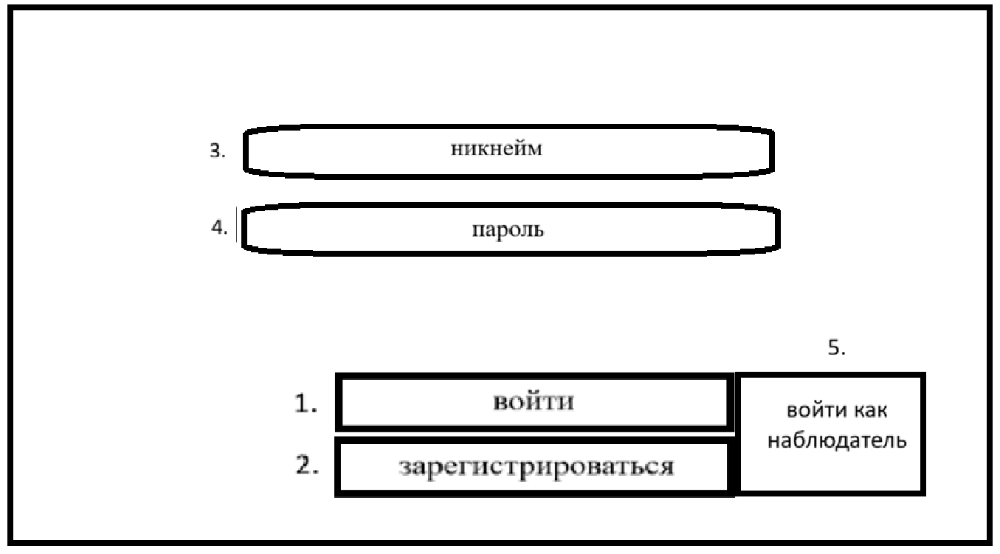
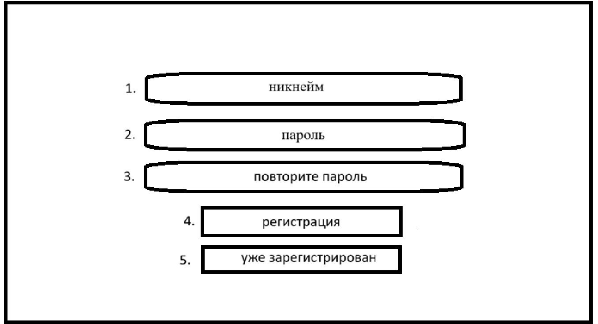
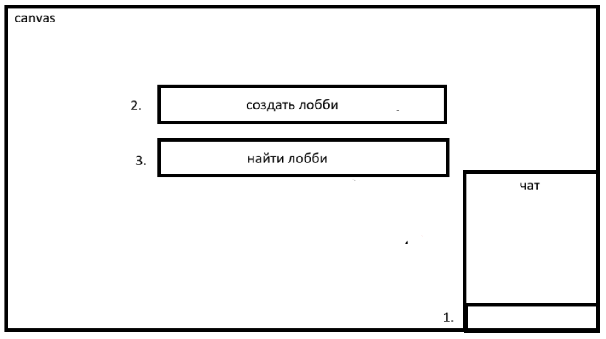
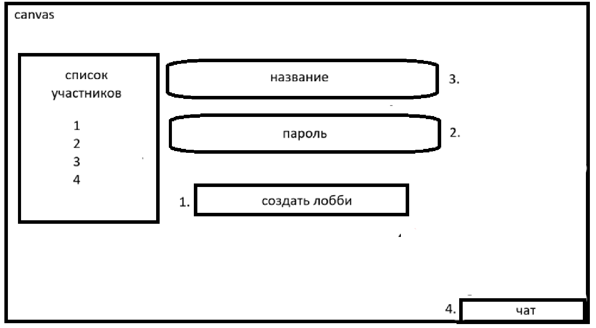
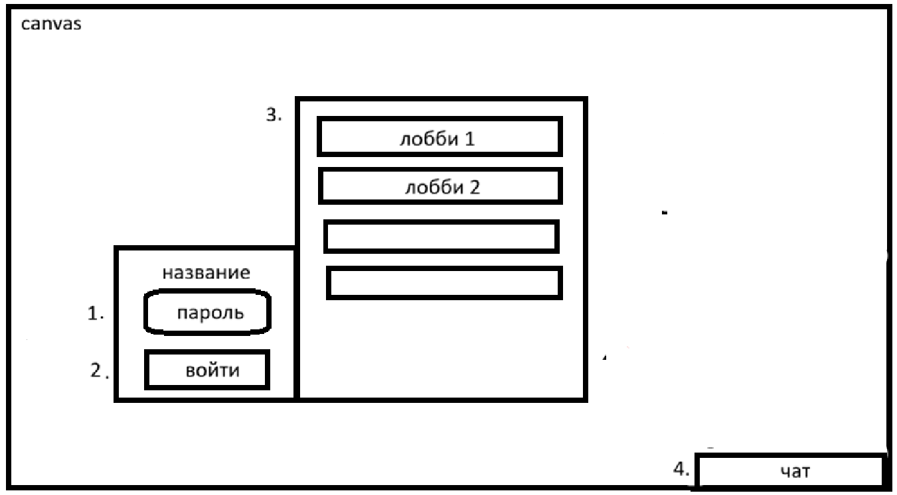
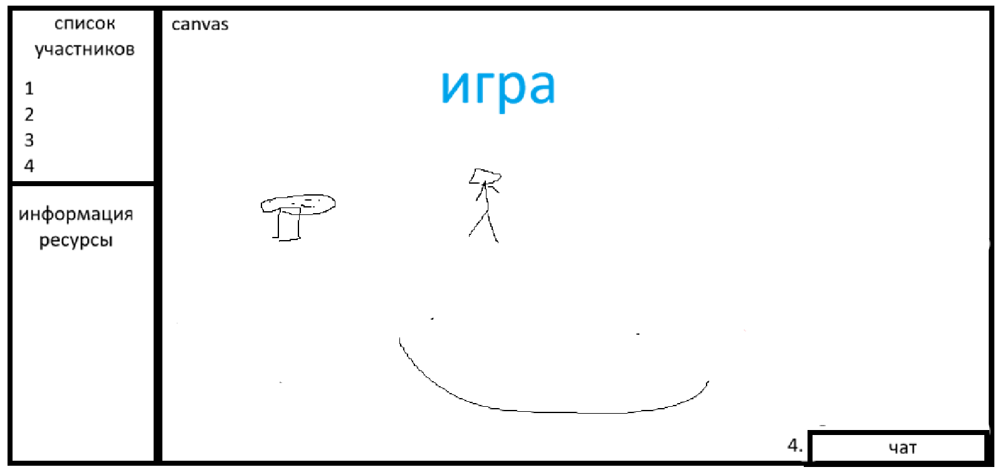

# Макет экранов интерфейса

## 1. Экран входа (Начальный экран)

1.  **Кнопка:** "Войти" — вход в аккаунт .
2.  **Кнопка:** "Зарегистрироваться" — переход на экран регистрации.
3.  **Поле ввода:** "Никнейм" — ввод логина.
4.  **Поле ввода:** "Пароль" — ввод пароля.
5.  **Кнопка:** "Войти как наблюдатель" — вход без аккаунта (режим только для просмотра).

## 2. Экран регистрации

1.  **Поле ввода:** "Никнейм" — ввод уникального имени пользователя.
2.  **Поле ввода:** "Пароль" — ввод пароля.
3.  **Поле ввода:** "Повторите пароль" — подтверждение пароля.
4.  **Кнопка:** "Регистрация" — создание нового аккаунта.
5.  **Кнопка:** "Уже зарегистрирован" — возврат на экран входа.

## 3. Экран лобби 

1.  **Поле ввода:** "Чат" — поле для ввода сообщений в общий чат.
2.  **Кнопка:** "Создать лобби" — открывает окно создания комнаты.
3.  **Кнопка:** "Найти лобби" — открывает окно со списком доступных комнат.

## 4. Экран "Создать лобби" 

1.  **Кнопка:** "Создать лобби" — создание лобби.
2.  **Поле ввода:** "Название" — название игровой комнаты.
3.  **Поле ввода:** "Пароль" — необязательное поле для установки пароля на комнату.
4.  **Кнопка:** "Чат" — открывает/закрывает боковую панель чата.

## 5. Экран "Поиск лобби" 

1.  **Поле ввода:** "Пароль"
2.  **Кнопка:** "Войти"
3.  **Список комнат:** Каждый элемент списка — кнопка. При нажатии на комнату с паролем появляется дополнительное поле для ввода пароля перед входом.
4.  **Кнопка:** "Чат" — открывает/закрывает боковую панель чата.

## 6. Игровой экран

*   **Основная область (Canvas):** Игровое поле 50x50. Рендеринг карты, юнитов, построек и тумана войны.
*   **Боковая панель:**
    *   **Список участников:** Слоты 1-4.
    *   **Информация:** Детали выделенного объекта.
    *   **Ресурсы:**
        *   Для людей: Нефть / Железо.
        *   Для грибов: Споры / Железо.
*   **Нижняя панель:**
    *   **Чат:** Область чата и поле ввода сообщений.